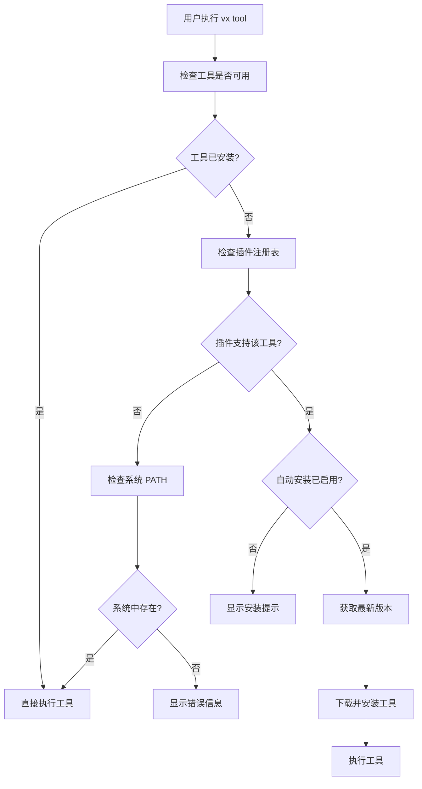

# vx 自动安装功能

## 概述

vx 提供了智能的自动安装功能，当用户尝试使用一个未安装的工具时，vx 会自动检测并安装该工具的最新版本。这个功能让用户可以无缝地使用各种开发工具，而无需手动安装。

## 功能特性

### 🚀 透明安装

- 当执行 `vx <tool>` 命令时，如果工具未安装，vx 会自动安装
- 用户无需额外的安装步骤，工具会在首次使用时自动获取
- 支持所有通过插件系统管理的工具

### ⚙️ 智能版本选择

- 自动选择工具的最新稳定版本进行安装
- 跳过预发布版本，确保稳定性
- 支持项目特定的版本要求（通过 .vx.toml 配置）

### 🔧 配置控制

- 可以通过配置文件控制是否启用自动安装
- 支持全局和项目级别的配置
- 提供详细的安装过程反馈

## 工作流程



## 使用示例

### 基本使用

```bash
# 首次使用 Node.js（如果未安装）
$ vx node --version
# vx 会自动安装最新版本的 Node.js，然后执行命令
# 输出: v20.10.0

# 首次使用 Python（如果未安装）
$ vx python --version
# vx 会自动安装最新版本的 Python，然后执行命令
# 输出: Python 3.12.0
```

### 项目特定版本

```bash
# 在项目目录中创建 .vx.toml
$ cat > .vx.toml << EOF
[tools]
node = "18.17.0"
python = "3.11.5"
EOF

# 使用项目指定的版本（自动安装）
$ vx node --version
# 输出: v18.17.0

$ vx python --version
# 输出: Python 3.11.5
```

## 配置选项

### 全局配置

在 `~/.vx/config.toml` 中：

```toml
[auto_install]
enabled = true                    # 启用自动安装
include_prerelease = false        # 是否包含预发布版本
timeout = 300                     # 安装超时时间（秒）
confirm_before_install = false    # 安装前是否需要确认

[auto_install.exclude]
tools = ["docker", "kubectl"]     # 排除自动安装的工具列表
```

### 项目配置

在项目的 `.vx.toml` 中：

```toml
[auto_install]
enabled = true                    # 项目级别的自动安装开关

[tools]
node = "18.17.0"                  # 指定工具版本
python = "3.11.5"
rust = "1.75.0"
```

## 安全考虑

### 🔒 安全特性

- 只从官方源下载工具
- 验证下载文件的完整性
- 使用隔离的安装目录
- 不会修改系统级别的工具安装

### ⚠️ 注意事项

- 自动安装功能默认启用，可以通过配置禁用
- 首次安装可能需要网络连接和一些时间
- 某些工具可能需要额外的系统依赖

## 故障排除

### 常见问题

**Q: 自动安装失败怎么办？**
A: 检查网络连接，确保可以访问工具的官方下载源。可以手动使用 `vx install <tool>` 命令安装。

**Q: 如何禁用自动安装？**
A: 在配置文件中设置 `auto_install.enabled = false`。

**Q: 如何查看安装进度？**
A: 使用 `--verbose` 标志可以看到详细的安装过程：`vx --verbose node --version`

**Q: 安装的工具存储在哪里？**
A: 工具安装在 `~/.vx/tools/<tool_name>/<version>/` 目录中。

### 日志和调试

```bash
# 查看详细的安装日志
$ vx --verbose node --version

# 检查工具安装状态
$ vx list

# 手动安装特定版本
$ vx install node@18.17.0
```

## 实现细节

自动安装功能在 `crates/vx-core/src/proxy.rs` 中实现，主要包含：

- `auto_install_tool()` 方法：核心安装逻辑
- 与插件系统的集成：通过 `VxTool` trait 获取版本信息
- 配置管理：支持全局和项目级别的配置
- 错误处理：提供友好的错误信息和建议

这个功能使 vx 成为一个真正的"零配置"工具管理器，用户可以立即开始使用任何支持的开发工具。
