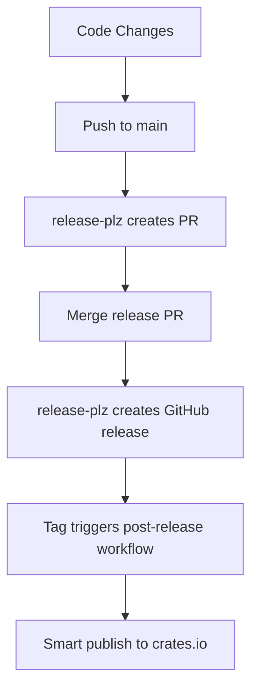

# Smart Publishing Strategy

This document describes the improved publishing strategy for the VX project that intelligently handles crates.io publishing.

## 🎯 Overview

The new smart publishing system addresses the key issues with the previous approach:

1. **Intelligent Version Checking**: Only publishes packages that don't already exist on crates.io
2. **Dependency-Aware Publishing**: Publishes packages in the correct dependency order
3. **Error Recovery**: Handles failures gracefully and provides detailed feedback
4. **Automated Workflow**: Triggers automatically after GitHub releases

## 🔄 Publishing Flow

### 1. Development & Release Creation



### 2. Smart Publishing Logic

The `scripts/smart-publish.sh` script implements intelligent publishing:

```bash
# Check if package exists on crates.io
check_package_exists() {
    # Uses cargo search to check existing versions
    # Only publishes if version doesn't exist
}

# Validate before publishing
validate_package() {
    # Build, test, and dry-run publish
    # Ensures package is ready for publication
}

# Publish in dependency order
packages=(
    "crates/vx-core"           # Base library
    "crates/vx-tools/*"        # Tool implementations
    "crates/vx-pm-npm"         # Package manager
    "crates/vx-cli"            # CLI (depends on all tools)
    "."                        # Main package (depends on CLI)
)
```

## 🚀 Usage

### Manual Publishing

```bash
# Dry run (recommended first)
DRY_RUN=true scripts/smart-publish.sh

# Actual publishing
DRY_RUN=false scripts/smart-publish.sh

# Force publish (even if version exists)
DRY_RUN=false FORCE_PUBLISH=true scripts/smart-publish.sh

# Skip tests (for CI environments)
DRY_RUN=false SKIP_TESTS=true scripts/smart-publish.sh
```

### Automated Publishing

The system automatically publishes when:

1. **GitHub Release Created**: The `post-release-publish.yml` workflow triggers
2. **Version Tag Pushed**: Any `v*` tag triggers the publishing workflow
3. **Manual Trigger**: Can be manually triggered via GitHub Actions UI

## 📋 Workflow Configuration

### release-plz.toml

```toml
[workspace]
allow_dirty = true
release_always = false  # Only release when needed
publish = false         # Don't auto-publish (use workflow)

[[package]]
name = "vx"
release = true          # Only manage main package
git_tag_enable = true   # Create tags
git_release_enable = true # Create GitHub releases
publish = false         # Use workflow for publishing
```

### GitHub Workflows

1. **release-plz.yml**: Creates release PRs and GitHub releases
2. **post-release-publish.yml**: Publishes to crates.io after tags
3. **release.yml**: Builds binaries and uploads to GitHub releases

## 🔧 Features

### Smart Version Detection

- Checks if packages already exist on crates.io
- Compares local version with published version
- Skips publishing if version already exists (unless forced)

### Dependency Management

- Publishes packages in correct dependency order
- Waits between publications for crates.io to update
- Handles workspace dependencies correctly

### Error Handling

- Validates packages before publishing
- Provides detailed error messages
- Stops on first failure in live mode
- Continues validation in dry-run mode

### Flexible Configuration

- `DRY_RUN`: Test without publishing
- `FORCE_PUBLISH`: Publish even if version exists
- `SKIP_TESTS`: Skip test execution (for CI)
- `WAIT_TIME`: Customize wait time between publications

## 🎯 Benefits

### For Developers

- **Reliable Publishing**: No more failed releases due to existing versions
- **Clear Feedback**: Detailed logging shows exactly what's happening
- **Safe Testing**: Dry-run mode validates everything without publishing

### For CI/CD

- **Automatic Recovery**: Handles partial failures gracefully
- **Idempotent**: Can be run multiple times safely
- **Fast Execution**: Skips unnecessary work

### For Users

- **Consistent Availability**: Packages are always available on crates.io
- **Proper Dependencies**: All dependencies are published in correct order
- **Reliable Installation**: `cargo install vx` always works

## 🔍 Troubleshooting

### Common Issues

1. **Version Mismatch**: Ensure Cargo.toml version matches the release tag
2. **Dependency Errors**: Check that all workspace dependencies have correct versions
3. **Network Issues**: Retry publishing after network problems resolve

### Manual Recovery

If automated publishing fails:

```bash
# Check what's already published
cargo search vx-core
cargo search vx-cli
cargo search vx

# Publish missing packages manually
cd crates/vx-core && cargo publish
cd crates/vx-cli && cargo publish
cargo publish
```

### Verification

After publishing, verify installation:

```bash
# Install from crates.io
cargo install vx

# Test basic functionality
vx --version
vx --help
```

## 📈 Future Improvements

1. **Parallel Publishing**: Publish independent packages in parallel
2. **Rollback Support**: Ability to yank problematic versions
3. **Metrics Collection**: Track publishing success rates and timing
4. **Integration Testing**: Automated testing of published packages

## 🔗 Related Files

- `scripts/smart-publish.sh`: Main publishing script
- `.github/workflows/post-release-publish.yml`: Automated publishing workflow
- `release-plz.toml`: Release automation configuration
- `docs/PUBLISHING_STRATEGY.md`: Previous publishing documentation
